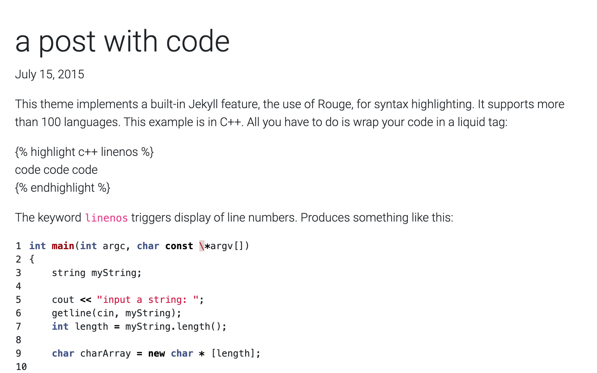

# How this works

regular jekyll setup stuff

# Content Organization

This site uses jekyll collections to organize most of the content

## academic
This collection is the sections on the front page /index. There should be any header sections for the main page here as well as markdown files for the content collections as described in the next section.

Minimal yml example:
```yml
---
title: "home"
display: "About"
news: news
---
```

if the `news` key is used, then this section will have a News list on the front page, taking the 3 most recent posts with this category and listing the `headline` if available or title with a link to the post main page.  The keyword News will link to the category page for that type of news

## content collections

These are the sections [`research`, `teaching`, `service`]
each of these (and any additional similar sections) should have a directory named accordingly and be added to the `_config.yml`

To generate the `/collection/ ` page there needs to be a file somewhere with the following yaml excerpt (mostly in `_academic`)

```yml
itemdata: <related collection name>
layout: collectionmain
```

For each of these collections, there needs to be a markdown in `/_academic`. This text from there will also be displayed at the top of the `/collection/ ` page.
 - `itemdata` must match the collection name exactly this will add the more info bar at the bottom of the section on the front page and fill this markdown content to the collection page
 -

### gallery

on these pages, add the following to yaml to add link/gallery content at the bottom.  The icon names are without the `fa` prefix, but include any font-awesome icon

```yml
gallery:
  - [<icon name>, link content]
```

## category

This is a processing collection to generate pages of blog content these are just yaml header matter to make the `_layout/category.html` page works

`type:blog` is required on all pages that need to use the blognav, this is flagged in `_layout/main` to change the width of the `<main>` section by setting the class

```yml
---
layout: category
title: As it should display
category: "Grad School"
type: blog
---
```


# Layouts

## default
shell ofthe page, outer content, mostly meta

## main

generally always used


# Notes

To do: add feature for pinned project/item to index.html, use collectionmain as reference to get it. Allow pinned collection item to be set by id in `_academic` post and then pulled into page, no requirement to edit actual item to pin/unpin a post.  Bonus, allow pinning on collection main for sort.
=======
# al-folio

[](https://travis-ci.org/alshedivat/al-folio)
[](https://alshedivat.github.io/al-folio/)
[](https://github.com/alshedivat/al-folio/blob/master/LICENSE)
[](https://gitter.im/alshedivat/al-folio?utm_source=badge&utm_medium=badge&utm_campaign=pr-badge)

A simple and clean [Jekyll](https://jekyllrb.com/) theme for academics.

[](https://alshedivat.github.io/al-folio/)

Originally, **al-folio** was based on the [\*folio theme](https://github.com/bogoli/-folio) (published by [Lia Bogoev](http://liabogoev.com) and under the MIT license).
Since then, it got a full re-write of the styles and many additional cool features.
The emphasis is on whitespace, transparency, and academic usage: [theme demo](https://alshedivat.github.io/al-folio/).

## Getting started

For more about how to use Jekyll, check out [this tutorial](https://www.taniarascia.com/make-a-static-website-with-jekyll/).
Why Jekyll? Read this [blog post](https://karpathy.github.io/2014/07/01/switching-to-jekyll/)!

### Installation

Assuming you have [Ruby](https://www.ruby-lang.org/en/downloads/) and [Bundler](https://bundler.io/) installed on your system (*hint: for ease of managing ruby gems, consider using [rbenv](https://github.com/rbenv/rbenv)*), first fork the theme from `github.com:alshedivat/al-folio` to `github.com:<your-username>/<your-repo-name>` and do the following:

```bash
$ git clone git@github.com:<your-username>/<your-repo-name>.git
$ cd <your-repo-name>
$ bundle install
$ bundle exec jekyll serve
```

Now, feel free to customize the theme however you like (don't forget to change the name!).
After you are done, **commit** your final changes.
Now, you can deploy your website to [GitHub Pages](https://pages.github.com/) by running the deploy script:

```bash
$ ./bin/deploy [--user]
```
By default, the script uses the `master` branch for the source code and deploys the webpage to `gh-pages`.
The optional flag `--user` tells it to deploy to `master` and use `source` for the source code instead.
Using `master` for deployment is a convention for [user and organization pages](https://help.github.com/articles/user-organization-and-project-pages/).

**Note:** when deploying your user or organization page, make sure the `_config.yml` has `url` and `baseurl` fields as follows.

```
url: # should be empty
baseurl:  # should be empty
```

### Usage

Note that `_pages/about.md` is built to index.html in the published site. There is therefore no need to have a separate index page for the project. If an index page does exist in the root directory then this will prevent `_pages/about.md` from being added to the built site.

## Features

#### Ergonomic Publications

Your publications page is generated automatically from your BibTex bibliography.
Simply edit `_bibliography/papers.bib`.
You can also add new `*.bib` files and customize the look of your publications however you like by editing `_pages/publications.md`.

Keep meta-information about your co-authors in `_data/coauthors.yml` and Jekyll will insert links to their webpages automatically.

#### Collections
This Jekyll theme implements collections to let you break up your work into categories.
The example is divided into news and projects, but easily revamp this into apps, short stories, courses, or whatever your creative work is.

> To do this, edit the collections in the `_config.yml` file, create a corresponding folder, and create a landing page for your collection, similar to `_pages/projects.md`.

Two different layouts are included: the blog layout, for a list of detailed descriptive list of entries, and the projects layout.
The projects layout overlays a descriptive hoverover on a background image.
If no image is provided, the square is auto-filled with the chosen theme color.
Thumbnail sizing is not necessary, as the grid crops images perfectly.

#### Theming
Six beautiful theme colors have been selected to choose from.
The default is purple, but quickly change it by editing `$theme-color` variable in the `_sass/variables.scss` file (line 72).
Other color variables are listed there, as well.

#### Photos
Photo formatting is made simple using rows of a 3-column system.
Make photos 1/3, 2/3, or full width.
Easily create beautiful grids within your blog posts and projects pages:

<p align="center">
  <a href="https://alshedivat.github.io/al-folio/projects/1_project/">
    
  </a>
</p>

#### Code Highlighting
This theme implements Jekyll's built in code syntax highlighting with Pygments.
Just use the liquid tags `` and `` to delineate your code:

<p align="center">
  <a href="https://alshedivat.github.io/al-folio/blog/2015/code/">
    
  </a>
</p>

## Contributing

Feel free to contribute new features and theme improvements by sending a pull request.
Style improvements and bug fixes are especially welcome.

## License

The theme is available as open source under the terms of the [MIT License](https://opensource.org/licenses/MIT).
